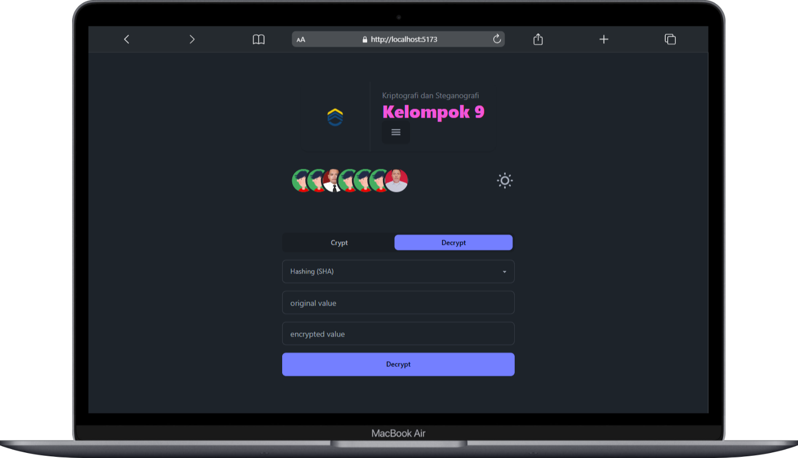
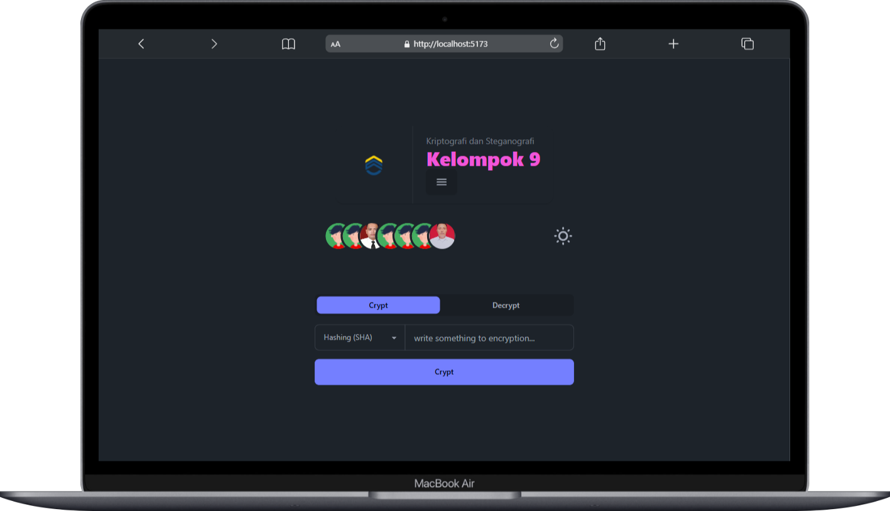
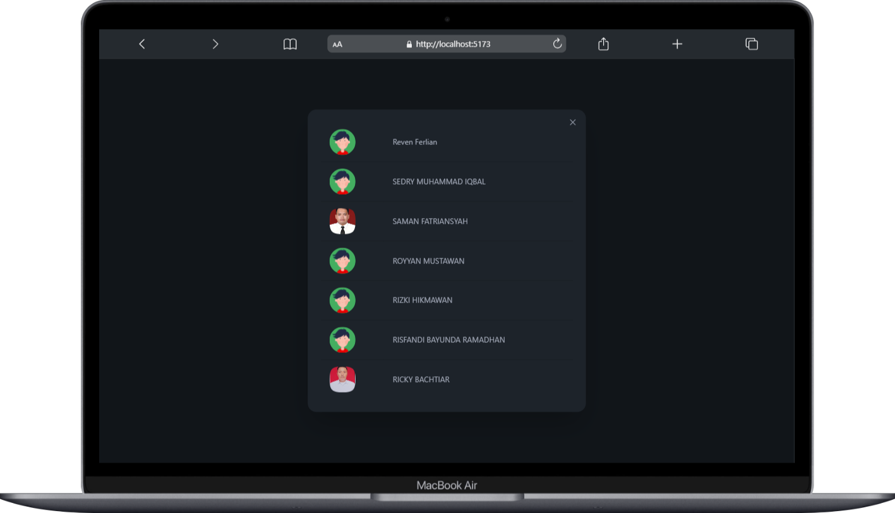
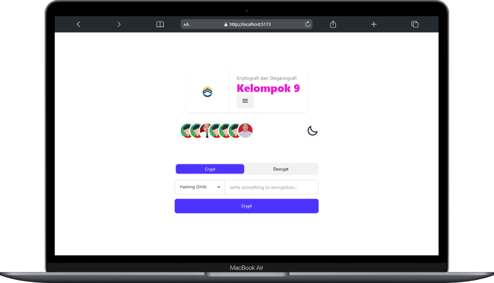

<table border="0">
    <tbody>
        <tr>
            <td align="left">
                 
            </td>
            <td align="right">
                <h3>Universitas Cyber Asia</h2>
            </td>
        </tr>
        <tr>
            <td width="50%" style="vertical-align: top;">
                <b>Kriptografi dan Steganografi</b>
                Ini merupakan tugas dari kelompok 9 mata kuliah *Kriptografi dan Steganografi* untuk membuat aplikasi yang dapat melakukan encrypt dan decrypt.
            </td>
            <td width="25%" style="vertical-align: top;">
                
            </td>
        </tr>
    </tbody>
</table>

## Table of Contents

- [Preview](#preview)
- [Technologies](#technologies)
  - [Backend](#backend)
  - [Frontend](#frontend)
- [Tutorial](#tutorial)

## Preview

<table border="0">
    <tbody>
        <tr>
            <td width="50%" style="vertical-align: top;">
                
            </td>
            <td width="50%" style="vertical-align: top;">
                
            </td>
        </tr>
        <tr>
            <td width="50%" style="vertical-align: top;">
                
            </td>
            <td width="50%" style="vertical-align: top;">
                
            </td>
        </tr>
    </tbody>
</table>

## Technologies

- Backend Technologies:
  - Python: bahasa pemrograman tingkat tinggi yang berorientasi objek, ditafsirkan, dan memiliki semantik dinamis.

- Frontend Technologies:
  - JavaScript (js) and TypeScript (ts)
  - Vue.js
  - Daisy UI

## Tutorial

- [SHA](docs/pdf/sha.pdf)
- [AES](docs/pdf/aes.pdf)
- [RSA](docs/pdf/rsa.pdf)
