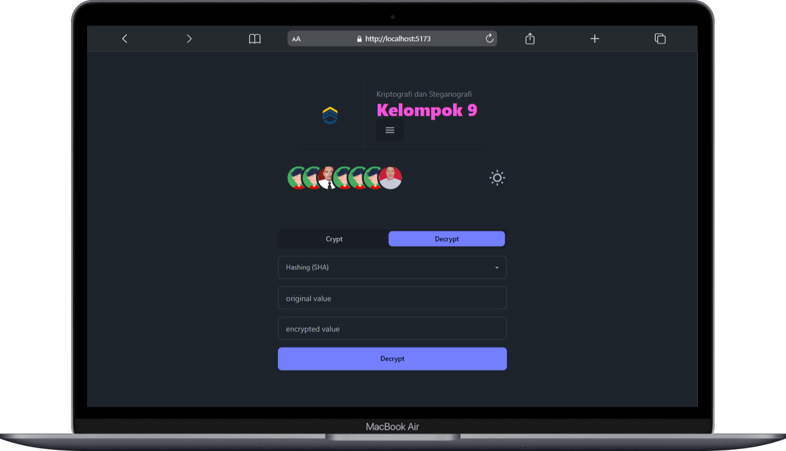
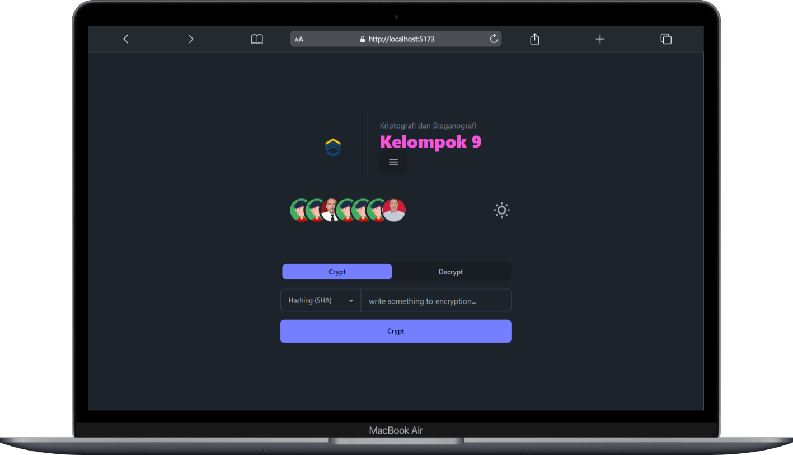
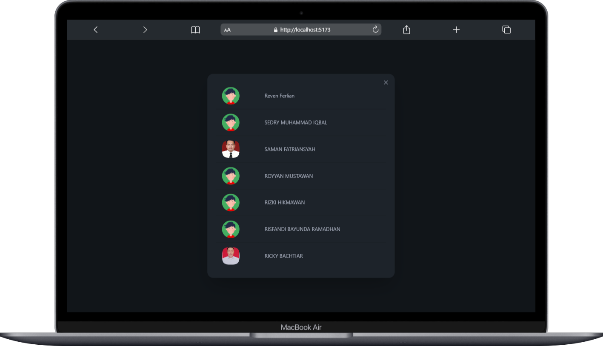
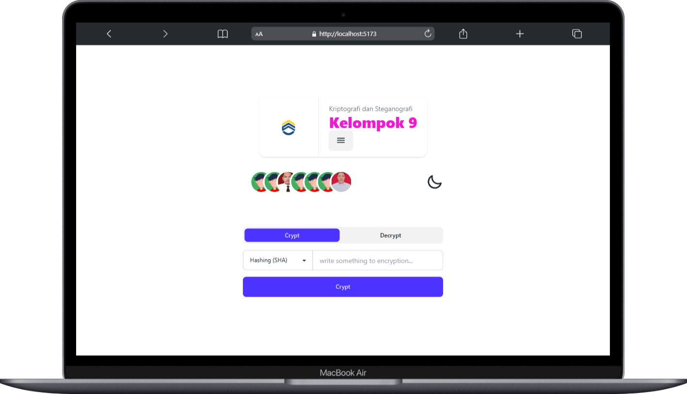

<table border="0">
    <tbody>
        <tr>
            <td align="left">
                 
            </td>
            <td align="right">
                <h3>Universitas Cyber Asia</h2>
            </td>
        </tr>
        <tr>
            <td width="50%" style="vertical-align: top;">
                <b>Kriptografi dan Steganografi</b>
                <span>Ini merupakan tugas dari kelompok 9 mata kuliah *Kriptografi dan Steganografi* untuk membuat aplikasi yang dapat melakukan encrypt dan decrypt.</span>
            </td>
            <td width="25%" style="vertical-align: top;">
                
            </td>
        </tr>
    </tbody>
</table>

## Table of Contents

- [Preview](#preview)
- [Technologies](#technologies)
- [Installation](#installation)
  - [Frontend](#frontend)
  - [Backend](#backend)
  - [Note](#note)
- [Tutorial](#tutorial)

## Preview

<table border="0">
    <tbody>
        <tr>
            <td width="50%" style="vertical-align: top;">
                
            </td>
            <td width="50%" style="vertical-align: top;">
                
            </td>
        </tr>
        <tr>
            <td width="50%" style="vertical-align: top;">
                
            </td>
            <td width="50%" style="vertical-align: top;">
                
            </td>
        </tr>
    </tbody>
</table>

## Technologies

- Backend Technologies:
  - Python: bahasa pemrograman tingkat tinggi yang berorientasi objek, ditafsirkan, dan memiliki semantik dinamis.

- Frontend Technologies:
  - JavaScript (js) and TypeScript (ts)
  - Vue.js
  - Daisy UI

## Installation

### Frontend

1. Please install yarn as a package manager for vue, you can visit [here](https://classic.yarnpkg.com/lang/en/docs/install/) if you doesn't have yarn.

2. After that install the module with command ``` yarn ``` to install all node package module.

3. If you see the console, you will be see system running. So, fe already running on your machine.

4. To make all function working we must be running BE.

### Backend

1. Go to folder be.

2. Running command ``` .venv\Scripts\activate ``` if you using windows. Another machine ? [click here](https://flask.palletsprojects.com/en/stable/installation/).

3. Running ```flask run```

### Note

- For BE url in FE still manual, not make global variable.

- Download document url in BE still manual not automatically.

## Tutorial

- [SHA](docs/pdf/sha.pdf)
- [AES](docs/pdf/aes.pdf)
- [RSA](docs/pdf/rsa.pdf)
